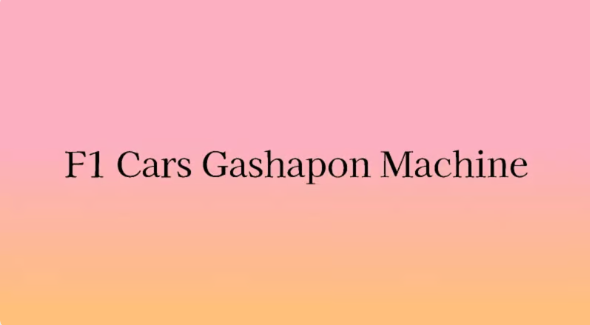

# F1-gashapon

An F1-style racing game built with React, Vite, and Phaser. The game features multiple racing circuits, two-player racing, keyboard controls, race countdowns, laps, checkpoints, collisions, engine and crash sounds, pause and restart options, and race result screens.

## Preview



## Live Demo

🔗 [F1 Race Game – Live Website](https://f1-gashapon.vercel.app/)

## Features

- F1-style racing gameplay
- Multiple racing circuits
- Two-player racing mode
- Player 1 controls using **WASD**
- Player 2 controls using **Arrow Keys**
- Race countdown and starting lights
- Lap and checkpoint system
- Collision detection
- Crash effects and sound effects
- Engine and race audio
- Pause and resume race
- Restart race option
- Quit race option
- Race result screen
- Winner and loser detection
- Responsive game canvas
- Designed for future qualifying and championship features
- Designed for future multiplayer racing

## Getting Started

This project was built with **React, Vite, and Phaser**.

In the project directory, you can run:

### `npm install`

Installs all the required project dependencies.

### `npm run dev`

Runs the app in development mode.

Open the local URL shown in the terminal to view the game in your browser.

The page will reload automatically when you make changes.

### `npm run build`

Builds the app for production.

## Project Structure

```text
public/
├── assets/
├── audio/
└── ...

src/
├── App.jsx
├── main.jsx
├── App.css
│
├── race/
│   ├── RaceGame.jsx
│   └── ...
│
├── components/
│   └── ...
│
└── assets/
    └── ...
    
package.json
vite.config.js
index.html
